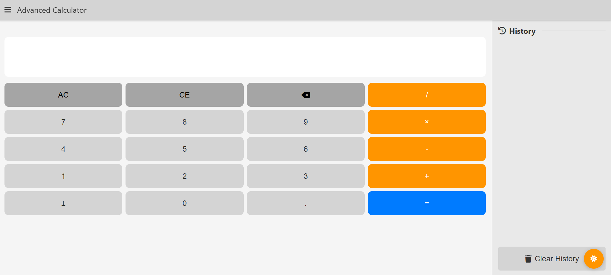
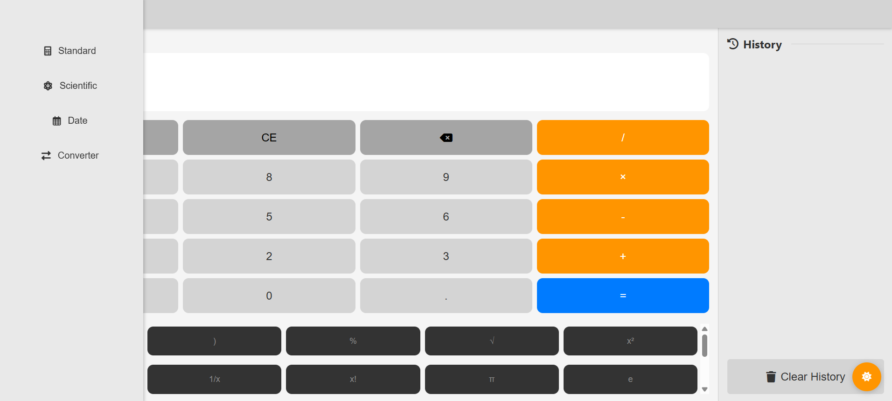

# Advanced Calculator Web Application

### **Overview**  
This project is a feature-rich, web-based calculator application created using HTML, CSS, and JavaScript. It offers four distinct calculation modes: Standard Calculation for basic arithmetic operations, Date Calculation to compute the difference between two dates , Scientific Calculator for Advanced functions (sin, cos, tan, log, ln, powers, roots) and last Unit Calculator for Convert between different measurement units. The calculator is designed with a clean and responsive user interface for ease of use.  

## Features

### 🧮 Calculator Modes
- **Standard Calculator**: Basic arithmetic operations (+, -, ×, ÷)
- **Scientific Calculator**: Advanced functions (sin, cos, tan, log, ln, powers, roots)
- **Date Calculator**: Calculate differences between dates
- **Unit Converter**: Convert between different measurement units

### ✨ Key Features
- History tracking with localStorage persistence
- Dark/Light theme toggle
- Fully responsive design
- Keyboard support
- Expression display showing full calculation
- Degree/Radian toggle for trigonometric functions

 ### **Screenshots**  

  

## Getting Started

### Prerequisites
- Modern web browser (Chrome, Firefox, Safari, Edge)
- Internet connection (for loading Font Awesome icons)

### Installation
No installation required! Simply open `index.html` in your web browser.

For development:
1. Clone the repository
2. Open `index.html` in your preferred browser

## Usage

### Basic Operations
1. Click the numbers and operators to build your calculation
2. Press `=` or Enter to calculate the result
3. Use `AC` to clear all or `CE` to clear last entry

### Scientific Functions
- Access scientific functions by clicking the "Scientific" button in the sidebar
- Trigonometric functions (sin, cos, tan) work in degrees or radians (toggle with "deg/rad" button)
- Additional functions include:
  - Square root (√)
  - Power (x^y)
  - Factorial (x!)
  - Logarithm (log, ln)
  - Constants (π, e)

### Date Calculator
- Select two dates to calculate the difference in days
- Shows weekday information for both dates
- Displays days until today if future date is selected

### Unit Converter
- Convert between different units of:
  - Length (mm, cm, m, km, inches, feet, miles)
  - Weight (mg, g, kg, oz, lb)
  - Temperature (°C, °F, K)
  - Area (mm², cm², m², acres, hectares)
  - Volume (ml, l, gallons, cubic meters)
  - Time (ns, ms, s, minutes, hours, days)

## Keyboard Support

The calculator supports keyboard input for most operations:

| Key | Function |
|-----|----------|
| 0-9 | Numbers |
| + | Addition |
| - | Subtraction |
| * | Multiplication |
| / | Division |
| . | Decimal point |
| Enter/= | Calculate result |
| Backspace | Clear last entry |
| Escape | Clear all |
| ( ) | Parentheses |
| ^ | Power |
| % | Percentage |

## Themes

Toggle between dark and light themes using the moon/sun icon in the bottom right corner. Your preference is saved in localStorage.

## Responsive Design

The calculator is fully responsive and works on:
- Mobile phones (portrait and landscape)
- Tablets
- Desktop computers

The layout automatically adjusts to provide the best user experience on each device size.

### **License**  
This project is licensed under the MIT License.  

---  
