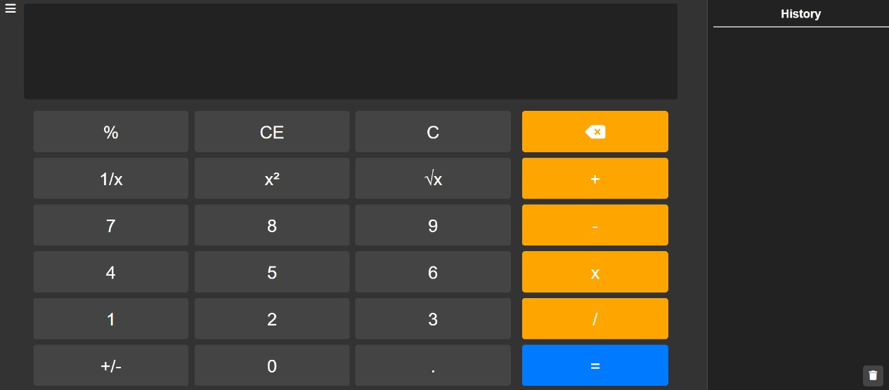
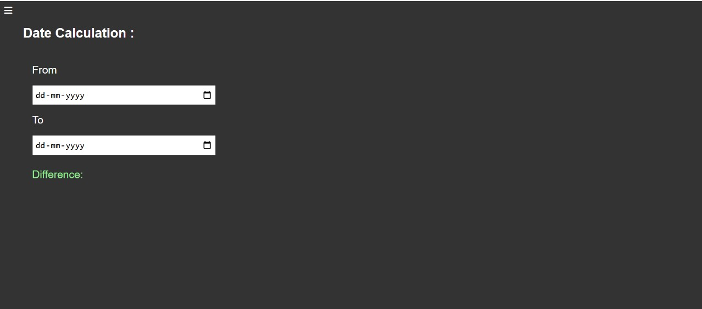

**Calculator Project**  

### **Overview**  
This project is a feature-rich, web-based calculator application created using HTML, CSS, and JavaScript. It offers two distinct calculation modes: Standard Calculation for basic arithmetic operations and Date Calculation to compute the difference between two dates. The calculator is designed with a clean and responsive user interface for ease of use.  

### **Features**  
- **Standard Calculation:** Perform basic arithmetic operations such as addition, subtraction, multiplication, and division.  
- **Date Calculation:** Input two dates to calculate the difference in days, months, or years.  
- **Responsive Design:** Works seamlessly across various devices, including desktops, tablets, and smartphones.  
- **Clear & Reset Options:** Users can clear input fields or reset calculations for convenience.  
- **Interactive Design:** Includes hover effects and visual feedback for buttons to enhance the user experience.  

### **Technologies**  
- **HTML:** Structures the layout and elements of the calculator.  
- **CSS:** Styles the calculator with a visually appealing and user-friendly design.  
- **JavaScript:** Implements functionality for standard and date-based calculations.  

### **Installation**  
1. **Clone the Repository:**  
   ```bash  
   git clone https://github.com/your-username/Calculator.git  
   ```  
2. **Navigate to the Project Directory:**  
   ```bash  
   cd Calculator  
   ```  
3. **Open the calculator File:**  
   - Open the `calculator.html` file in any modern web browser to use the calculator.  

### **Usage**  
1. **Choose Calculation Mode:**  
   - Select **Standard Calculation** or **Date Calculation** from the interface.  
2. **Perform Calculations:**  
   - For Standard Calculation, input numbers and select operations.  
   - For Date Calculation, input two dates to calculate their difference.  
3. **View Results:**  
   - Results will appear in the designated output section after performing calculations.  

### **Screenshots**  





  

### **Future Enhancements**  
- **Scientific Mode:** Add advanced operations like trigonometry, logarithms, and square roots.  
- **Themed Interface:** Introduce light and dark mode themes for user customization.  
- **Error Handling:** Improve error messages for invalid inputs or incorrect operations.  
- **Memory Functions:** Add features like memory recall, storage, and clear options.  

### **License**  
This project is licensed under the MIT License.  

---  
